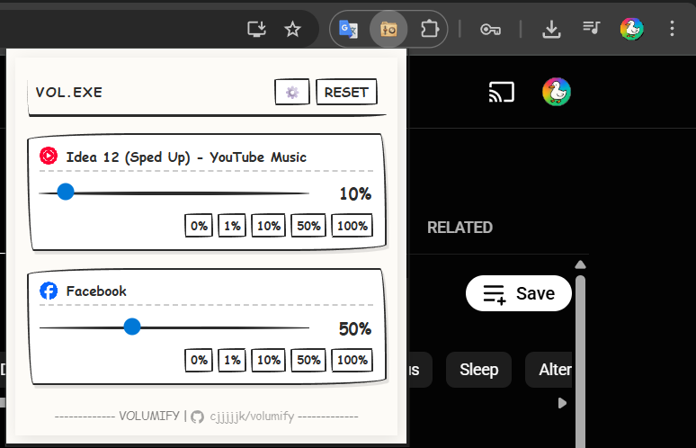

# **volumify**

**volumify** is a chrome extension that gives you granular control over the volume of individual browser tabs. perfect for managing multiple audio sources at once!  

## ✨ features

- 🎚️ **individual tab volume control** - adjust the volume of each tab independently from 0% to 150%
- 🎨 **retro themes** - choose between classic windows 95 and hand-drawn retro styles
- 🔇 **quick presets** - instantly set volume to 0%, 1%, 10%, 50%, or 100% with one click
- 💾 **persistent settings** - your volume preferences are saved and restored automatically
- 🖼️ **tab favicons** - easily identify tabs with their site icons
- ⚡ **real-time updates** - smooth volume transitions

## 📥 download

volumify: **[download latest release](https://github.com/cjjjjjk/volumify/releases/latest)**

## 🚀 installation

1. download the latest release zip file from the link above
2. extract the zip file to a folder on your computer
3. open chrome and navigate to `chrome://extensions/`
4. enable **developer mode** (toggle in the top-right corner)
5. click **load unpacked**
6. select the extracted folder
7. the volumify icon should appear in your extensions toolbar!

## 🎨 themes

volumify comes with two beautiful retro themes:

- **win95** - classic windows 95 aesthetic with that nostalgic gray look
- **hand-drawn retro** - a playful, sketchy design with a vintage feel

## 🔧 technical details

- **manifest version**: 3
- **permissions**: `tabCapture`, `offscreen`, `storage`, `tabs`
- **architecture**: uses chrome's offscreen api for efficient audio processing
- **audio processing**: web audio api with gain nodes for precise volume control

## 🐛 known limitations

- cannot control volume on chrome system pages (e.g., `chrome://` urls)
- requires `activetab` permission to capture audio from tabs

## 📝 license

this project is open source and available under the mit license.

## 🤝 contributing

contributions, issues, and feature requests are welcome! feel free to check the issues page.

## 💡 tips

- the **0%** button acts as a quick mute for any tab
- volume settings persist across browser sessions
- you can boost volume up to 150% for quieter audio sources
- the active tab is always shown first in the list

---

made with ❤️ for better audio control in your browser
